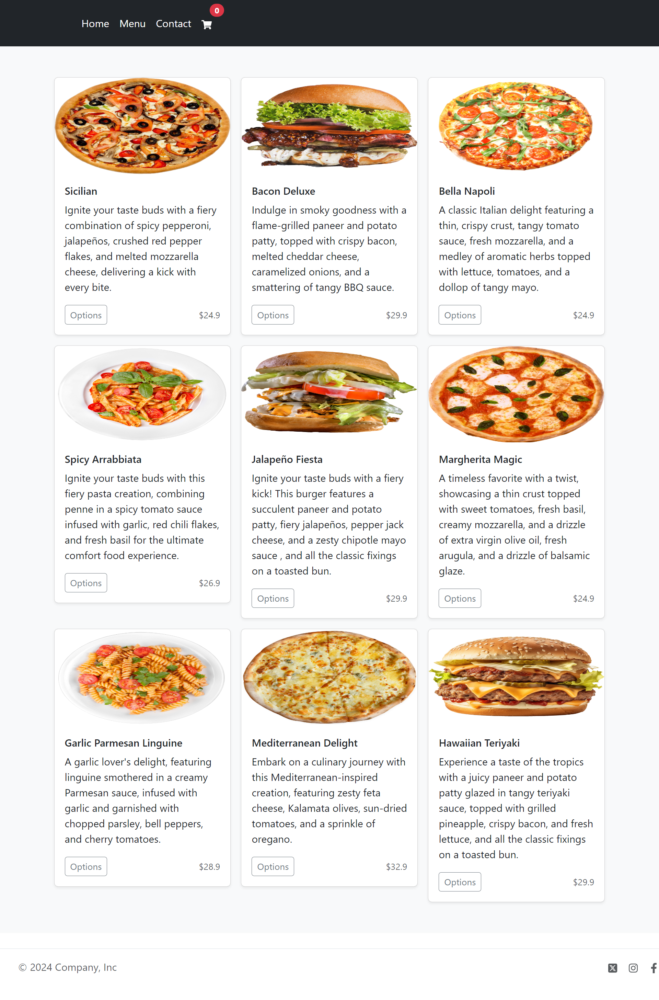
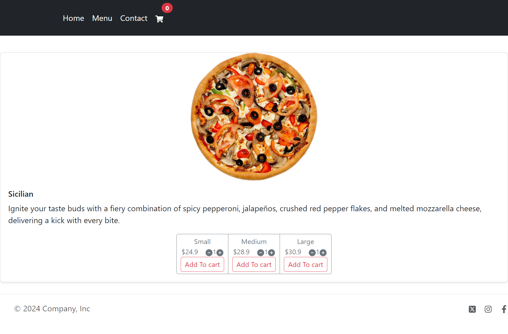
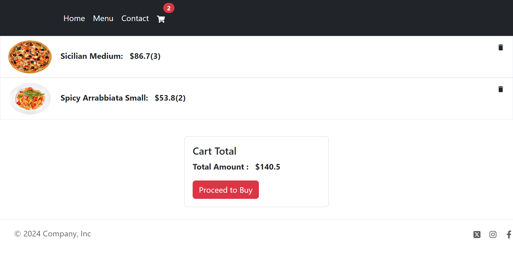
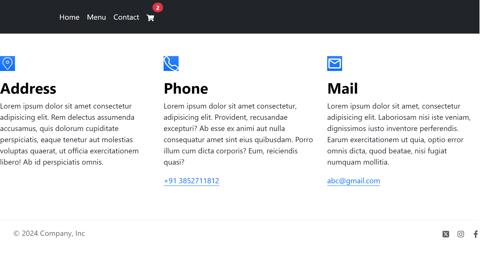

# Food Odering Website(frontend)

Create a delightful Food Ordering website offering a variety of delicious options, including pizza, burgers, and pasta. This interactive web application allows users to browse the menu, "customize their orders i.e small_medium_large or choose the quantity", and place orders for delivery or pickup. With a user-friendly interface and seamless ordering process, this website provides a convenient solution for satisfying hunger cravings with just a few clicks.

## Technologies Used

- React.js
- React Router
- Bootstrap
- JavaScript
- HTML
- CSS

## Screenshots :

- Home

- Menu

- Product

- Cart

- Contact

